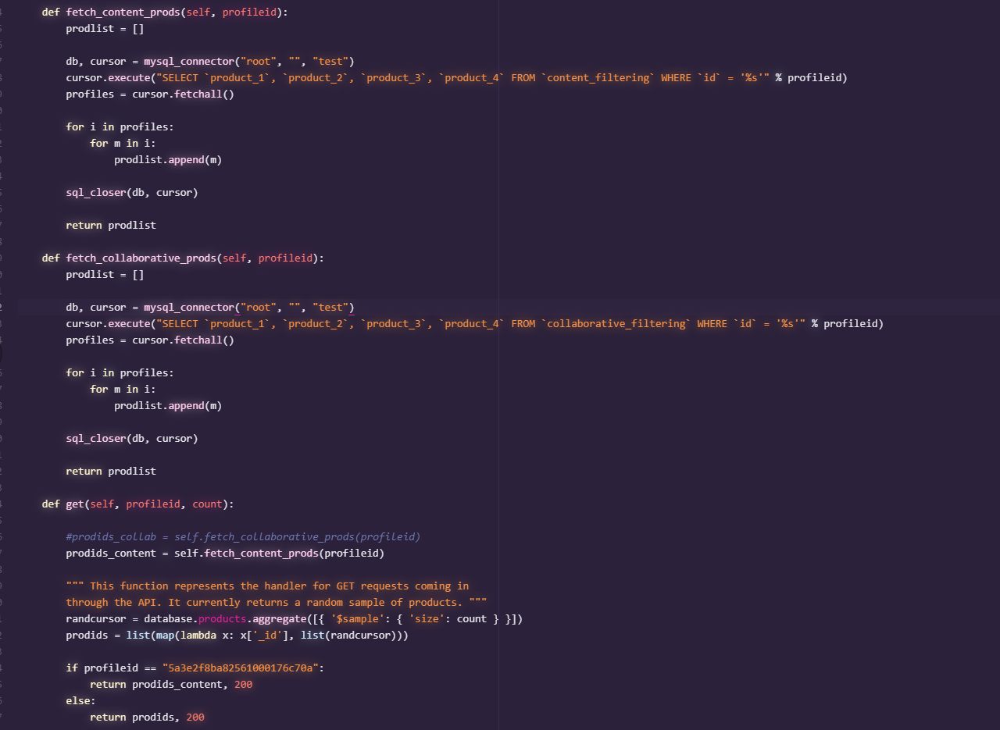

# Opdracht Recommendation-Engine
Git voor het opdracht Business rules voor Recommendation Engine. 
Op het moment werk de recommendation op een profiel aangezien het best lang kan duren voordat elke recommendation gemaakt kan worden

De profiel: 5a3e2f8ba82561000176c70a

# Leden
Ceyhun Cakir | 1784480

# Content Recommendation
Content recommendation word gemaakt gebasseerd op vergelijkbaren categorieen (main categorie, gender, doelgroep) van een product

De content recommendation bestaat uit de volgende stappen
```
stap 1: Krijg profiel data met de gekochte producten
stap 2: Zoek naar vergelijkbaren producten gebaseerd op categorieen van het gekochte producten binnen de profiel
stap 3: Voeg alle producten met de zelfde categorieen toe aan een lijst 
stap 4: Uiteindelijk returnen we 4 random producten binnen het lijst met de profileid 
```

# Collaborative Recommendation
Collaborative recommendation word gemaakt gebasseerd op vergelijkbaren profielen die producten hebben gekocht met de vergelijkbaren categorieen (main categorie, gender, doelgroep)

De collaborative recommendation bestaat uit de volgende stappen
```
stap 1: Krijg profiel data met de gekochte producten
stap 2: Zoek naar vergelijkbaren profielen gebaseerd op gekochte producten met de zelfde categorieen van het profiel waar we een recommendation willen maken
stap 3: Random profiel word gekozen als een vergelijkbaren profiel
stap 4: Random gekozen producten binnen de random gekozen profiel worden toegevoegd aan een lijst
stap 5: Uiteindelijk returnen we 4 random producten binnen het lijst met de profileid
```

# HUwebshop
Zoals we zien werkt het op de Huwebshop door naar de volgende fotos te bekijken



# Versie
Versie 1.0.1 | 18-3-2021
